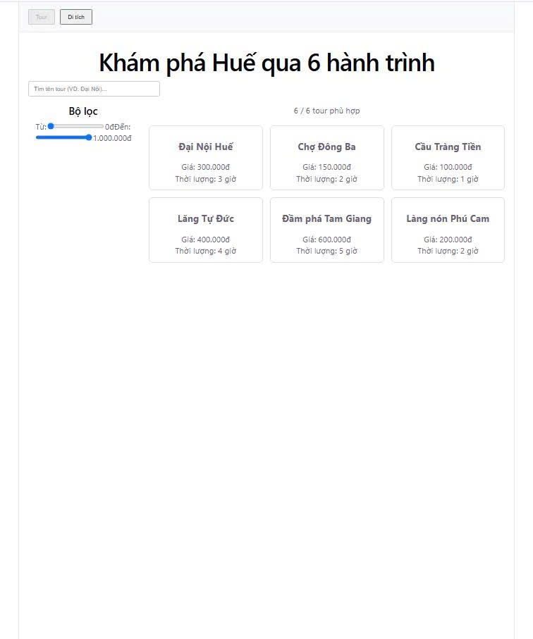
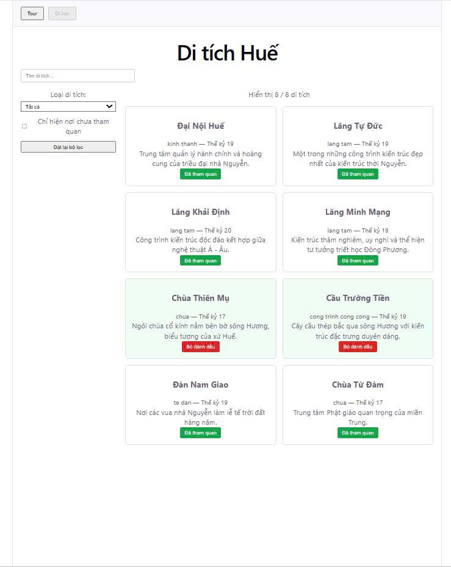

---

## 1. Hình ảnh giao diện thực tế

### Trang Tour Huế


### Trang Di tích Huế (Module mới Lab 4)


---

## 2. Sơ đồ cây thành phần (Component Tree)

```text
App
├── Navigation (Tab selector: 'tour' | 'ditich')
├── TourListContainer (khi chọn tab 'tour')
└── DiTichListView (khi chọn tab 'ditich' - gọi custom hook `useDiTichList`)
    └── PageLayout (Named Slots Pattern)
        ├── SearchBox (slot: header)
        ├── DiTichFilter (slot: sidebar)
        └── DiTichCard × N (slot: main)