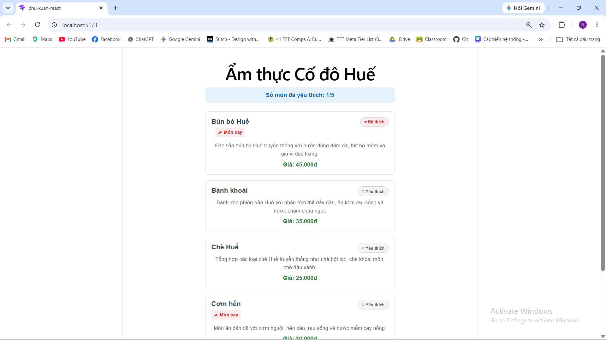

# Ẩm thực Cố đô Huế - Phu Xuan React (Buổi 5)

Ứng dụng thực đơn ẩm thực Huế được xây dựng bằng React, Vite và TypeScript/JSX. Dự án thực hành các kiến thức cơ bản về Component Composition, Props, State (`useState`), Conditional Rendering và lifting state up.

## 📸 Demo giao diện



## ✨ Tính năng chính

* **Danh sách thực đơn động:** Hiển thị danh sách món ăn từ dữ liệu `menuItems` (Bún bò Huế, Bánh khoái, Chè Huế, Cơm hến,...).
* **Định dạng tiền tệ:** Tự động hiển thị giá tiền chuẩn định dạng Việt Nam (ví dụ: `45.000đ`).
* **Nhãn món cay (Conditional Rendering):** Tự động nhận biết món ăn cay để gắn nhãn `🌶 Món cay`.
* **Yêu thích món ăn (State & Callback):** Bấm nút để đánh dấu/bỏ đánh dấu món ăn yêu thích độc lập.
* **Đếm tổng số món yêu thích (Lifting State Up):** Quản lý trạng thái ở `App` và tính tổng số món đã chọn (`n/5`).

## 🛠 Thư viện & Công nghệ

* **Frontend:** React, Vite, JavaScript / TypeScript.
* **Styling:** CSS / Inline Styles.

## 🚀 Hướng dẫn cài đặt & Chạy ứng dụng

1. **Clone repository:**
   ```bash
   git clone [https://github.com/HoangSpring/phu-xuan-react.git](https://github.com/HoangSpring/phu-xuan-react.git)
   cd phu-xuan-react