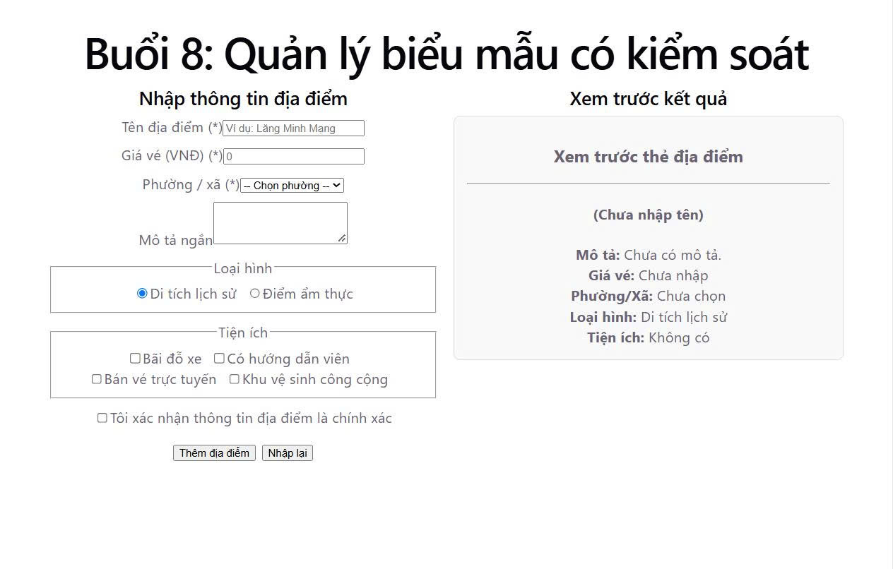

# Buổi 8: Quản lý Biểu mẫu có Kiểm soát trong React (Controlled Forms)

Dự án thực hành quản lý biểu mẫu (Form) trong ReactJS, từ các ô nhập dữ liệu cơ bản, validation (kiểm chứng dữ liệu), tạo Custom Hook `useForm` đến việc nâng trạng thái (state lifting) để hiển thị khung xem trước (preview) theo thời gian thực.

---

## 📸 Giao diện ứng dụng



---

## 📁 Cấu trúc thư mục

```text
src/
├── features/
│   ├── dia-diem/
│   │   ├── FormThemDiaDiem.jsx      # Biểu mẫu nhập thông tin địa điểm
│   │   ├── KhungXemTruoc.jsx        # Component xem trước kết quả realtime
│   │   ├── TrangQuanLyDiaDiem.jsx    # Component cha quản lý state chung (Lab 5)
│   │   └── kiemChung.js             # Hàm validation kiểm tra dữ liệu đầu vào
│   └── gop-y/
│       └── FormGopY.jsx             # Biểu mẫu góp ý (tái sử dụng useForm hook)
├── hooks/
│   └── useForm.js                   # Custom Hook đóng gói toàn bộ logic quản lý Form
├── App.jsx                          # Component chính
└── main.tsx                         # Entry point ứng dụng